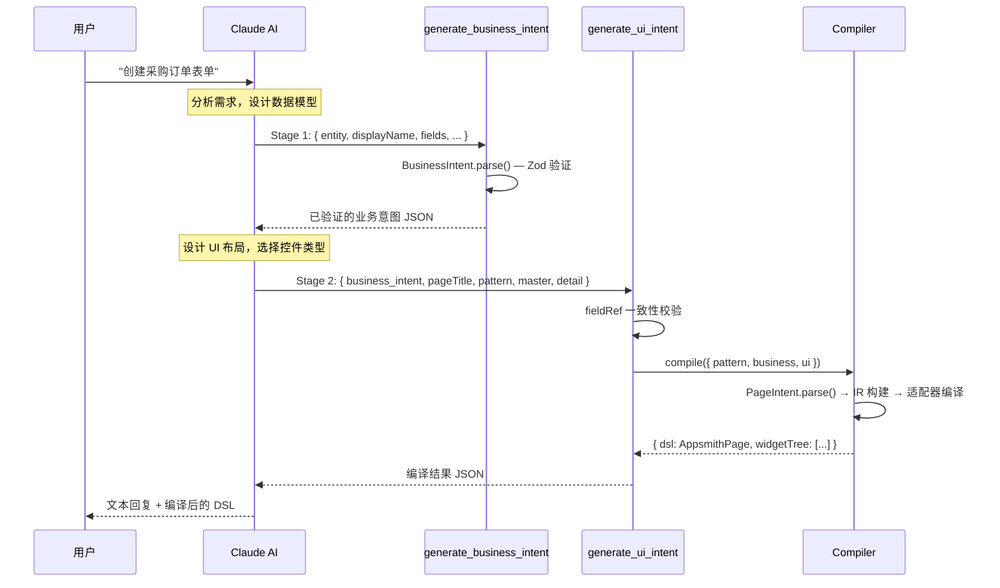

# IntentSmith AI Agent 集成详细说明

## 目录

- [1. 概述](#1-概述)
- [2. 整体架构](#2-整体架构)
- [3. 核心依赖](#3-核心依赖)
- [4. 后端代码结构](#4-后端代码结构)
- [5. Claude Agent SDK 集成](#5-claude-agent-sdk-集成)
- [6. MCP 工具服务器](#6-mcp-工具服务器)
- [7. 系统提示词工程](#7-系统提示词工程)
- [8. 两阶段编译流水线](#8-两阶段编译流水线)
- [9. 多轮对话与会话管理](#9-多轮对话与会话管理)
- [10. 预热会话池](#10-预热会话池)
- [11. WebSocket 通信协议](#11-websocket-通信协议)
- [12. 子进程环境管理](#12-子进程环境管理)
- [13. 编译器流水线](#13-编译器流水线)
- [14. 从零搭建操作步骤](#14-从零搭建操作步骤)
- [15. 关键配置项](#15-关键配置项)
- [16. 常见问题与排查](#16-常见问题与排查)

---

## 1. 概述

IntentSmith 通过 **Claude Agent SDK** 将 Claude AI 作为后端 Agent 引擎，用户在前端用自然语言描述需求，后端 Agent 将自然语言转换为结构化意图 JSON，再通过编译器生成 Appsmith 页面 DSL。

核心设计理念：**AI 不直接输出代码，而是通过 MCP 工具调用编译器** —— Claude 负责"理解需求 + 生成意图"，编译器负责"意图 → DSL 的确定性转换"。

```
用户自然语言 → Claude Agent (理解+生成意图) → MCP 工具 (验证+编译) → Appsmith DSL
```

---

## 2. 整体架构

```mermaid
flowchart TB
  subgraph 前端["前端 (React SPA)"]
    UI[聊天界面 + 预览面板]
  end

  subgraph 后端["后端 (Bun.serve)"]
    WS[WebSocket Server]
    Pool[WarmSessionPool<br/>预热会话池]
    SP[System Prompt Builder<br/>系统提示词构建器]
  end

  subgraph Agent["Claude Agent SDK"]
    Query[query() 函数]
    Session[会话管理<br/>persist / resume]
  end

  subgraph MCP["进程内 MCP Server"]
    T1[generate_business_intent<br/>阶段1：业务意图验证]
    T2[generate_ui_intent<br/>阶段2：UI意图验证+编译]
    T3[compile_intent<br/>遗留：单阶段编译]
  end

  subgraph Compiler["编译器"]
    Parse[Zod Schema 解析]
    IR[IR 中间表示构建]
    Adapter[目标适配器<br/>Appsmith / Flutter]
  end

  UI -->|WebSocket| WS
  WS --> Pool
  WS --> SP
  Pool --> Query
  SP --> Query
  Query -->|流式输出| WS
  Query -->|tool_call| T1 & T2
  T1 -->|Zod 验证| Parse
  T2 -->|fieldRef 校验| Parse
  T2 --> IR --> Adapter
  Adapter -->|CompileResult| T2
  T2 -->|tool_result| Query
```

---

## 3. 核心依赖

| 包名 | 版本 | 用途 | 代码位置 |
|------|------|------|----------|
| `@anthropic-ai/claude-agent-sdk` | ^0.2.89 | Claude Agent 核心 SDK，提供 `query()` 和 `createSdkMcpServer()` | `src/server.ts:7` |
| `@modelcontextprotocol/sdk` | ^1.29.0 | MCP 协议 SDK，提供 `McpServer` 类（备用实现） | `src/mcp/server.ts:4` |
| `zod` | ^4.3.6 | 运行时 Schema 验证 | `src/compiler/schemas/` |

**安装命令：**

```bash
bun add @anthropic-ai/claude-agent-sdk @modelcontextprotocol/sdk zod
```

---

## 4. 后端代码结构

```
src/
├── server.ts                          # 🔴 核心：WebSocket 服务器 + Agent 编排
│   ├── createMcpConfig()              #    创建进程内 MCP 服务器（每次 query 新建）
│   ├── buildClaudeOptions()           #    构建 query() 调用参数
│   ├── handlePrompt()                 #    处理用户提示的主函数
│   ├── WarmSessionPool                #    预热会话池类
│   └── spawnClaudeCode()              #    自定义子进程启动钩子
│
├── agent/
│   └── system-prompt.ts               # 🔴 系统提示词构建
│       ├── buildSystemPrompt()        #    主提示词（含 schema + 示例）
│       ├── buildFollowUpSection()     #    跟进模式提示词注入
│       ├── businessIntentJsonSchema() #    业务意图 JSON Schema
│       └── uiIntentJsonSchema()       #    UI 意图 JSON Schema
│
├── schema/
│   └── intent.ts                      #    Schema 统一导出
│
├── mcp/
│   └── server.ts                      #    独立 MCP 服务器（备用实现）
│
├── compiler/
│   ├── index.ts                       #    编译器入口：compile()
│   ├── schemas/
│   │   ├── business-intent.ts         #    业务意图 Zod Schema
│   │   └── ui-intent.ts              #    UI 意图 Zod Schema
│   ├── ir/                            #    中间表示构建器
│   │   ├── types.ts                   #    IRDocument / IRNode 类型
│   │   ├── master-detail.ts           #    主从模式 IR
│   │   ├── crud-table.ts             #    CRUD 表格 IR
│   │   ├── dashboard.ts              #    仪表盘 IR
│   │   └── sidebar-form.ts           #    侧边栏表单 IR
│   ├── adapters/
│   │   ├── types.ts                   #    TargetAdapter 接口
│   │   ├── index.ts                   #    适配器注册表
│   │   ├── appsmith/index.ts          #    Appsmith 适配器
│   │   └── flutter/index.ts           #    Flutter 适配器（存根）
│   ├── templates/                     #    布局模板预设
│   ├── widgets.ts                     #    Appsmith 控件工厂
│   ├── tree.ts                        #    控件树构建
│   ├── layout.ts                      #    布局计算
│   ├── bindings.ts                    #    动态绑定解析
│   └── ids.ts                         #    控件 ID 生成
│
└── ui/                                #    前端 React SPA
```

---

## 5. Claude Agent SDK 集成

### 5.1 核心 API：`query()` 函数

`query()` 是 Claude Agent SDK 的核心入口，它启动一个 Claude Code 子进程，发送提示词，并返回一个 **异步生成器** 用于流式接收消息。

**源码位置：** `src/server.ts:7`

```typescript
import { query, createSdkMcpServer } from "@anthropic-ai/claude-agent-sdk";
```

### 5.2 构建 query 参数：`buildClaudeOptions()`

**源码位置：** `src/server.ts:293-338`

```typescript
function buildClaudeOptions(
  abortController?: AbortController,
  currentIntent?: PageIntent,
  isFollowUp = false
): Record<string, unknown>
```

此函数构建传给 `query()` 的完整配置对象。返回值的关键字段：

| 字段 | 值 | 说明 |
|------|------|------|
| `agent` | `"intent-smith"` | Agent 名称标识 |
| `agents` | `{ "intent-smith": {...} }` | Agent 定义，含 prompt + mcpServers |
| `model` | `"claude-sonnet-4-6"` | 使用的 Claude 模型 |
| `effort` | 首轮 `"low"` / 跟进 `"medium"` | 推理深度控制 |
| `tools` | `[]` | **禁用所有内置工具**（Bash/Read/Glob 等） |
| `mcpServers` | `{ "intent-smith": createMcpConfig() }` | 进程内 MCP 服务器 |
| `allowedTools` | `["mcp__intent-smith__generate_business_intent", ...]` | 仅允许 MCP 工具 |
| `permissionMode` | `"bypassPermissions"` | 跳过权限确认 |
| `allowDangerouslySkipPermissions` | `true` | 允许危险权限跳过 |
| `includePartialMessages` | `true` | 包含部分消息（用于流式输出） |
| `persistSession` | `false`（正常） / `true`（预热） | 是否持久化会话 |
| `spawnClaudeCodeProcess` | `spawnClaudeCode` | 自定义子进程启动函数 |
| `env` | 清理后的环境变量 | 移除 CLAUDECODE，映射 AUTH_TOKEN |
| `maxTurns` | Agent 定义中为 `5` | AI 最大工具调用轮数 |

**完整配置构建代码：**

```typescript
{
  ...(abortController ? { abortController } : {}),
  env,                                              // 清理后的环境变量
  spawnClaudeCodeProcess: spawnClaudeCode,          // 自定义启动钩子
  agent: "intent-smith",                            // 使用的 Agent 名称
  agents: {
    "intent-smith": {
      description: "IntentSmith — generates Appsmith page DSL from natural language",
      prompt: systemPrompt,                         // buildSystemPrompt() 的输出
      tools: [],                                    // 不使用内置工具
      mcpServers: ["intent-smith"],                 // 引用 MCP 服务器
      maxTurns: 5,                                  // 最大工具调用轮数
    },
  },
  cwd: SERVER_CWD,
  tools: [],                                        // 禁用 Bash/Read/Glob 等
  mcpServers: {
    "intent-smith": createMcpConfig(),              // 每次创建新 MCP 实例
  },
  allowedTools: [
    "mcp__intent-smith__generate_business_intent",
    "mcp__intent-smith__generate_ui_intent",
    "mcp__intent-smith__compile_intent",
  ],
  permissionMode: "bypassPermissions",
  allowDangerouslySkipPermissions: true,
  includePartialMessages: true,
  model: "claude-sonnet-4-6",
  effort: isFollowUp ? "medium" : "low",
  persistSession: false,
}
```

### 5.3 调用 query() 并处理流式响应

**源码位置：** `src/server.ts:439-687`

```typescript
async function handlePrompt(ws: IS_WebSocket, text: string) {
  const abortController = new AbortController();
  // ... 构建 options ...

  // 发起 query
  q = query({ prompt: text, options: { ...opts, resume: warmSessionId } });

  // 流式迭代消息
  for await (const msg of q) {
    if (abortController.signal.aborted) break;

    switch (msg.type) {
      case "stream_event": {
        // 处理文本增量和工具调用开始
        const event = msg.event;
        if (event.type === "content_block_delta") {
          const delta = event.delta;
          if (delta?.type === "text_delta" && delta.text) {
            send(ws, { type: "text_chunk", text: delta.text });
          }
        }
        if (event.type === "content_block_start") {
          const block = event.content_block;
          if (block?.type === "tool_use") {
            // 检测到工具调用开始
            toolCalls.set(block.id, block.name.replace(/^mcp__.*?__/, ""));
          }
        }
        break;
      }

      case "assistant": {
        // 完整的 assistant 消息 — 提取 tool_use 块
        for (const block of msg.message.content) {
          if (block.type === "tool_use") {
            send(ws, { type: "tool_call", toolCallId: block.id, name, input: block.input });
          }
        }
        break;
      }

      case "user": {
        // SDK 注入的工具结果（在工具执行后）
        for (const block of msg.message.content) {
          if (block.type === "tool_result") {
            send(ws, { type: "tool_result", toolCallId, content, isError });
            // 从工具结果中捕获意图状态（用于多轮对话）
          }
        }
        break;
      }

      case "result": {
        send(ws, { type: "turn_end" });
        break;
      }
    }
  }
}
```

### 5.4 流式消息类型一览

| `msg.type` | 含义 | 处理方式 |
|------------|------|---------|
| `stream_event` | Claude API 的原始流式事件 | 提取 text_delta → 转发文本；检测 tool_use 开始 |
| `assistant` | 完整的 assistant 消息 | 提取 tool_use 块 → 转发工具调用 |
| `user` | SDK 注入的用户消息（含 tool_result） | 提取工具结果 → 转发 + 捕获意图状态 |
| `result` | query 结束 | 发送 turn_end |

---

## 6. MCP 工具服务器

### 6.1 使用 `createSdkMcpServer()` 创建进程内 MCP 服务器

**源码位置：** `src/server.ts:88-239`

MCP 服务器通过 Claude Agent SDK 提供的 `createSdkMcpServer()` 创建，运行在与 WebSocket 服务器 **同一进程** 内。每次调用 `query()` 时必须创建一个新实例。

```typescript
import { createSdkMcpServer } from "@anthropic-ai/claude-agent-sdk";

function createMcpConfig() {
  return createSdkMcpServer({
    name: "intent-smith",
    version: "0.2.0",
    tools: [ /* 工具定义数组 */ ],
  });
}
```

> **为什么每次都要创建新实例？** SDK 会将 transport 绑定到 server 实例上，复用同一实例会导致 `"Already connected to a transport"` 错误。

### 6.2 工具定义详解

#### 工具 1：`generate_business_intent`（阶段 1）

**用途：** 验证业务意图 JSON，返回规范化结果

```typescript
{
  name: "generate_business_intent",
  description: "Validates a business intent JSON ... Call this tool FIRST.",
  inputSchema: {
    entity: z.string(),
    displayName: z.string(),
    operations: z.array(z.string()).optional(),
    fields: z.array(z.object({
      name: z.string(),
      label: z.string(),
      dataType: z.string(),
      required: z.boolean().optional(),
      isPrimaryKey: z.boolean().optional(),
      referenceEntity: z.string().optional(),
      enumValues: z.array(z.string()).optional(),
    })),
    relations: z.array(...).optional(),
    rules: z.array(...).optional(),
  },
  handler: async (input) => {
    const validated = BusinessIntent.parse(input);
    return { content: [{ type: "text", text: JSON.stringify(validated) }] };
  },
}
```

#### 工具 2：`generate_ui_intent`（阶段 2）

**用途：** 验证 UI 意图的 fieldRef 一致性，然后编译为 Appsmith DSL

```typescript
{
  name: "generate_ui_intent",
  description: "Validates a UI intent JSON against the business intent ... Call SECOND.",
  inputSchema: {
    business_intent: z.object({ ... }),  // 阶段 1 的输出
    pageTitle: z.string(),
    pattern: z.string(),
    master: z.object({ ... }).optional(),
    detail: z.object({ ... }).optional(),
  },
  handler: async (input) => {
    // 1. fieldRef 一致性校验
    const businessFields = new Set(input.business_intent.fields.map(f => f.name));
    const allFieldRefs = [...masterFieldRefs, ...detailFieldRefs];
    const invalidRefs = allFieldRefs.filter(ref => !businessFields.has(ref));
    if (invalidRefs.length > 0) return { isError: true, ... };

    // 2. 组装编译输入
    const compileInput = {
      pattern: input.pattern,
      business: input.business_intent,
      ui: { pageTitle, pattern, master, detail },
    };

    // 3. 调用编译器
    const result = compile(compileInput);
    return { content: [{ type: "text", text: JSON.stringify(result) }] };
  },
}
```

#### 工具 3：`compile_intent`（遗留）

单阶段合并编译，向后兼容。直接接收 `{ pattern, business, ui }` 并编译。

### 6.3 备用 MCP 实现

**源码位置：** `src/mcp/server.ts`

项目还包含一个使用 `@modelcontextprotocol/sdk` 的 `McpServer` 独立实现。此版本增加了 `stage1Called` 标志，强制执行阶段顺序。当前主代码路径使用 `createSdkMcpServer()` 版本。

---

## 7. 系统提示词工程

### 7.1 提示词结构

**源码位置：** `src/agent/system-prompt.ts:7-159`

`buildSystemPrompt()` 构建的提示词包含以下部分：

```
┌─────────────────────────────────────────────┐
│ 1. 角色定义                                  │
│    "You are IntentSmith, a UI intent         │
│     generator for Appsmith applications."    │
├─────────────────────────────────────────────┤
│ 2. 两阶段工作流说明                           │
│    Stage 1 → Stage 2 顺序要求                │
├─────────────────────────────────────────────┤
│ 3. Business Intent JSON Schema               │
│    (由 businessIntentJsonSchema() 生成)       │
├─────────────────────────────────────────────┤
│ 4. UI Intent JSON Schema                     │
│    (由 uiIntentJsonSchema() 生成)            │
├─────────────────────────────────────────────┤
│ 5. 规则约束                                  │
│    - 字段唯一性、fieldRef 引用、中文文本       │
├─────────────────────────────────────────────┤
│ 6. 数据类型 → 控件类型映射表                  │
├─────────────────────────────────────────────┤
│ 7. 页面模式选择指南                           │
├─────────────────────────────────────────────┤
│ 8. 完整示例（采购订单 + 仪表盘）              │
├─────────────────────────────────────────────┤
│ 9. [可选] FOLLOW-UP MODE 部分                │
│    (仅跟进轮次，注入当前完整意图 JSON)        │
├─────────────────────────────────────────────┤
│ 10. Tool Usage 后缀                          │
│     (强制只使用两个 MCP 工具)                 │
└─────────────────────────────────────────────┘
```

### 7.2 工具使用后缀

**源码位置：** `src/server.ts:275-291`

在系统提示词末尾追加严格的工具使用约束：

```typescript
const TOOL_USAGE_SUFFIX = `
## Tool Usage — CRITICAL

You have exactly TWO tools available: generate_business_intent and generate_ui_intent.
You MUST NOT use any other tool.
DO NOT use Bash, Read, Glob, Write, Grep, or any file system tool.
If you use any tool other than these two, the interaction is considered a failure.

Follow the two-stage workflow:
1. Call generate_business_intent with the data model.
2. Call generate_ui_intent with the validated business intent + UI layout.

Both calls must happen in the same turn.
Do NOT output the DSL yourself — always use the tools.
Never use emojis.`;
```

### 7.3 跟进模式提示词注入

**源码位置：** `src/agent/system-prompt.ts:162-200`

当 `currentIntent` 存在时，追加 FOLLOW-UP MODE 部分：

```typescript
function buildFollowUpSection(intent: PageIntent): string {
  return `
## FOLLOW-UP MODE — Modifying "${displayName}" (${entity})

**CRITICAL: You are modifying an EXISTING "${displayName}" intent.**

You MUST keep: entity="${entity}", displayName="${displayName}", pattern="${intent.pattern}".
The current intent has ${fieldCount} fields: ${fieldNames}.
Your output MUST contain ALL of these fields unless the user explicitly asks to remove one.

### Current Business Intent (your baseline — copy this and apply changes)
\`\`\`json
${businessJson}
\`\`\`

### Current UI Intent (your baseline — copy this and apply changes)
\`\`\`json
${uiJson}
\`\`\`

### Modification Rules — MANDATORY
1. You MUST call both tools — a text-only response is INVALID
2. NEVER change entity, displayName, or pattern
3. Start from the JSON above — apply ONLY the user's changes
4. Preserve ALL existing fields unless explicitly asked to remove
...`;
}
```

---

## 8. 两阶段编译流水线



**为什么分两阶段？**

1. **关注点分离**：业务意图（WHAT）与 UI 意图（HOW）独立定义，减少 AI 混淆
2. **强一致性校验**：阶段 2 通过 `fieldRef` 引用阶段 1 的字段名，在编译前校验引用有效性
3. **减少幻觉**：AI 不直接输出 DSL，而是生成结构化意图 JSON，由确定性编译器转换

---

## 9. 多轮对话与会话管理

### 9.1 会话状态结构

**源码位置：** `src/server.ts:252-265`

每个 WebSocket 连接维护独立的会话状态：

```typescript
interface WsData {
  sessionId: string | null;              // Claude SDK 会话 ID
  conversationSessionId: string | null;  // 对话会话 ID
  currentIntent: StoredIntent | null;    // 当前意图（多轮保持）
  turnCount: number;                     // 对话轮次计数
  abortController: AbortController | null;
  closeCurrentQuery: (() => void) | null;
}

interface StoredIntent {
  pattern: string;
  business: unknown;
  ui: unknown;
}
```

### 9.2 意图状态捕获

**源码位置：** `src/server.ts:639-656`

从 MCP 工具结果中捕获意图，保存到 `ws.data.currentIntent`：

- `generate_business_intent` 的结果 → 保存为 `currentIntent.business`
- `generate_ui_intent` 的**输入**（非输出） → 保存为 `currentIntent.ui`

> 为什么保存输入而非输出？因为 `generate_ui_intent` 的输出是编译后的 DSL，而跟进模式需要的是原始 UI 意图形状（pageTitle, pattern, master, detail）。

### 9.3 跟进轮次的处理

**源码位置：** `src/server.ts:444-478`

```typescript
const isFollowUp = ws.data.turnCount > 0 && ws.data.currentIntent != null;

if (isFollowUp) {
  // 1. 注入当前意图到系统提示词
  const currentIntent = { pattern, business, ui } as PageIntent;
  const opts = buildClaudeOptions(abortController, currentIntent, isFollowUp);

  // 2. 创建专用预热会话（不复用预热池）
  const followUpWarmId = randomUUID();
  const warmup = query({ prompt: "ready", options: { ...opts, maxTurns: 1, persistSession: true } });
  for await (const _msg of warmup) { /* 等待预热完成 */ }

  // 3. 使用预热会话发起实际 query
  q = query({ prompt: text, options: { ...opts, resume: followUpWarmId } });
}
```

> **为什么跟进轮次不复用预热池？** 预热池的会话使用基础系统提示词（无 FOLLOW-UP MODE），而跟进轮次需要包含当前意图的不同提示词。SDK 在 resume 时保留原始 Agent 配置，因此必须用跟进提示词单独预热。

### 9.4 会话重置

**源码位置：** `src/server.ts:737-744`

```typescript
if (msg.type === "reset") {
  ws.data.conversationSessionId = null;
  ws.data.currentIntent = null;
  ws.data.turnCount = 0;
  ws.data.closeCurrentQuery?.();
  ws.data.abortController?.abort();
}
```

---

## 10. 预热会话池

### 10.1 设计目的

Claude Code 子进程启动 + MCP 工具注册需要数秒的冷启动时间。预热池提前初始化会话，用户提交提示时直接 resume 已初始化的会话。

### 10.2 WarmSessionPool 类

**源码位置：** `src/server.ts:345-433`

```typescript
class WarmSessionPool {
  private readonly idle: string[] = [];  // 已就绪的 sessionId 队列
  private warming = 0;                   // 正在预热的数量
  private nextRetryAt = 0;              // 冷却期截止时间

  constructor(private readonly poolSize: number) {}

  // 获取一个预热会话
  acquire(): { sessionId: string | null; reason: WarmAcquireReason }

  // 触发补充
  warmup(): void

  // 关闭所有会话
  shutdown(): void
}
```

### 10.3 预热流程

```typescript
private spawnOne(): void {
  const sessionId = randomUUID();

  // 使用 maxTurns: 1 执行一次完整初始化
  const q = query({
    prompt: "Respond with just the word 'ready'.",
    options: {
      ...buildClaudeOptions(),
      sessionId,
      maxTurns: 1,
      persistSession: true,  // 保持会话以便后续 resume
    },
  });

  // 完全消费生成器（确保初始化完成）
  for await (const _msg of q) { /* discard */ }
  this.idle.push(sessionId);
}
```

### 10.4 使用流程

```
服务器启动 → warmup() → spawnOne() × poolSize
    │
用户提交 → acquire() → 取 idle 会话 → query({ resume: sessionId })
    │                                       │
    └── idle 为空 → 冷路径（现场预热后 resume）
    │
    └── 取出后 → replenish() → 补充新会话
```

### 10.5 冷却机制

预热失败（如 API 不可用）时，设置 30 秒冷却期，避免频繁重试：

```typescript
this.nextRetryAt = Date.now() + 30_000;
```

---

## 11. WebSocket 通信协议

### 11.1 消息格式

**服务器 → 客户端：**

```typescript
type WsOutMessage =
  | { type: "text_chunk"; text: string }           // AI 流式文本
  | { type: "tool_call"; toolCallId: string;       // AI 发起工具调用
      name: string; input: unknown }
  | { type: "tool_result"; toolCallId: string;     // 工具执行结果
      content: string; isError?: boolean }
  | { type: "turn_end" }                           // 轮次结束
  | { type: "error"; message: string };            // 错误
```

**客户端 → 服务器：**

```typescript
{ type: "prompt", text: string }  // 用户输入
{ type: "reset" }                  // 重置会话
```

### 11.2 典型消息时序

```
Client  →  Server: { type: "prompt", text: "创建产品列表" }

Server  →  Client: { type: "text_chunk", text: "我来帮您..." }
Server  →  Client: { type: "tool_call", name: "generate_business_intent", input: {...} }
Server  →  Client: { type: "tool_result", content: "{...validated...}" }
Server  →  Client: { type: "tool_call", name: "generate_ui_intent", input: {...} }
Server  →  Client: { type: "tool_result", content: "{...dsl+widgetTree...}" }
Server  →  Client: { type: "text_chunk", text: "已为您生成..." }
Server  →  Client: { type: "turn_end" }
```

### 11.3 工具名称规范化

SDK 返回的工具名带有 MCP 前缀（如 `mcp__intent-smith__generate_business_intent`），在转发给前端前进行规范化：

```typescript
const name = block.name.replace(/^mcp__.*?__/, "");
// "mcp__intent-smith__generate_business_intent" → "generate_business_intent"
```

---

## 12. 子进程环境管理

### 12.1 问题背景

Claude Agent SDK 通过 `query()` 启动 Claude Code 子进程。在 Bun 环境下，两个环境变量问题需要处理：

1. **CLAUDECODE**：如果存在，子进程会认为自己运行在另一个 Claude Code 会话内，拒绝启动
2. **ANTHROPIC_AUTH_TOKEN**：SDK 需要的是 `ANTHROPIC_API_KEY`，需要映射

### 12.2 自定义 spawn 钩子

**源码位置：** `src/server.ts:31-43`

```typescript
function spawnClaudeCode(options) {
  // 清理环境变量
  const cleanEnv = {};
  for (const [k, v] of Object.entries(cleanEnvForSubprocess(options.env))) {
    if (v != null) cleanEnv[k] = v;
  }

  // 使用 child_process.spawn 替代默认行为
  const child = spawn(options.command, options.args, {
    cwd: options.cwd,
    env: cleanEnv,
    stdio: ["pipe", "pipe", "inherit"],  // stdin/stdout 管道，stderr 继承
  });

  options.signal.addEventListener("abort", () => { child.kill(); });
  return child;
}
```

### 12.3 环境变量清理

**源码位置：** `src/server.ts:20-27`

```typescript
function cleanEnvForSubprocess(env) {
  const cleaned = { ...env };
  delete cleaned.CLAUDECODE;                           // 防止嵌套检测
  if (cleaned.ANTHROPIC_AUTH_TOKEN && !cleaned.ANTHROPIC_API_KEY) {
    cleaned.ANTHROPIC_API_KEY = cleaned.ANTHROPIC_AUTH_TOKEN;  // 映射认证令牌
  }
  return cleaned;
}
```

---

## 13. 编译器流水线

### 13.1 编译器入口

**源码位置：** `src/compiler/index.ts`

```typescript
export function compile(intentJson: unknown, target?: string): CompileResult {
  // 1. Zod 解析验证
  const intent = PageIntent.parse(intentJson);

  // 2. 获取目标适配器（默认 Appsmith）
  const adapter = target ? getAdapter(target) : getDefaultAdapter();

  // 3. 按模式路由到 IR 构建器
  switch (intent.pattern) {
    case "master_detail":
      return adapter.compile(buildMasterDetailIR(intent));
    case "grid_only":
      const ir = intent.ui.layoutTemplate === "dashboard"
        ? buildDashboardIR(intent) : buildCrudTableIR(intent);
      return adapter.compile(ir);
    case "sidebar_form":
      return adapter.compile(buildSidebarFormIR(intent));
  }
}
```

### 13.2 数据流

```
Intent JSON
  │
  ▼
PageIntent.parse()          Zod 运行时验证
  │
  ▼
IR Builder                  buildMasterDetailIR() / buildCrudTableIR() / ...
  │                         生成平台无关的 IRDocument { pattern, entity, title, nodes[] }
  ▼
TargetAdapter.compile()     appsmithAdapter.compile(ir)
  │                         IR → Appsmith DSL (AppsmithPage + Widget 树)
  ▼
CompileResult { dsl, widgetTree }
```

### 13.3 IR 类型定义

**源码位置：** `src/compiler/ir/types.ts`

```typescript
interface IRDocument {
  pattern: string;    // 页面模式
  entity: string;     // 实体名
  title: string;      // 页面标题
  nodes: IRNode[];    // 根节点数组
}

interface IRNode {
  id: string;
  widgetType: string;                 // "field" | "tab" | "grid" 等
  label: string;
  layout: IRNodeLayout;               // { row, col, rowSpan, colSpan }
  props: Record<string, unknown>;     // 控件属性
  children?: IRNode[];
}
```

### 13.4 适配器接口

**源码位置：** `src/compiler/adapters/types.ts`

```typescript
interface TargetAdapter<T = unknown> {
  readonly name: string;
  readonly description: string;
  compile(ir: IRDocument): T;
}
```

当前注册的适配器：

| 适配器 | 状态 | 输出格式 |
|--------|------|---------|
| `appsmith` | 生产可用 | `{ dsl: AppsmithPage, widgetTree: IRNode[] }` |
| `flutter` | 存根 | 未实现 |

---

## 14. 从零搭建操作步骤

### 步骤 1：环境准备

```bash
# 安装 Bun
curl -fsSL https://bun.sh/install | bash
# 或 Windows: powershell -c "irm bun.sh/install.ps1 | iex"

bun --version  # 确认 >= 1.3.10
```

### 步骤 2：安装依赖

```bash
cd intent-smith
bun install
```

### 步骤 3：配置环境变量

创建 `.env` 文件（Bun 自动加载，无需 dotenv）：

```env
# 必填：Anthropic API 密钥
ANTHROPIC_API_KEY=sk-ant-xxxxx

# 可选：API 代理地址（如使用自有网关）
ANTHROPIC_BASE_URL=https://api.anthropic.com

# 可选：备选认证令牌（自动映射到 ANTHROPIC_API_KEY）
ANTHROPIC_AUTH_TOKEN=

# 可选：预热池大小（默认 1，设 0 禁用预热）
INTENT_SMITH_WARM_POOL_SIZE=1

# 可选：服务端口（默认 3001）
PORT=3001
```

### 步骤 4：启动服务

```bash
# 开发模式（前后端同时启动）
bun run dev

# 或分别启动
bun run dev:backend   # 后端 WebSocket 服务器 → http://localhost:3001
bun run dev:ui        # 前端 Vite 开发服务器 → http://localhost:3000
```

### 步骤 5：验证启动

观察 stderr 日志，确认以下输出：

```
IntentSmith server running at http://localhost:3001
[warm-pool] pre-warming 1 session(s) using query()+resume
[warm-pool] warmed session xxxxxxxx-xxxx-xxxx-xxxx-xxxxxxxxxxxx; idle=1/1
```

### 步骤 6：使用

1. 浏览器访问 `http://localhost:3001`（或 Vite 的 `http://localhost:3000`）
2. 在聊天框中输入自然语言描述，如 `创建采购订单表单，包含单据编号、日期、供应商`
3. 等待 AI 生成意图并编译为 Appsmith DSL
4. 在右侧预览面板查看生成结果

### 步骤 7：运行测试

```bash
# 单元测试
bun test

# E2E 测试（需先安装浏览器）
bunx playwright install chromium
bunx playwright test
```

---

## 15. 关键配置项

### 15.1 模型与推理配置

| 配置 | 当前值 | 位置 | 说明 |
|------|--------|------|------|
| `model` | `"claude-sonnet-4-6"` | `server.ts:335` | Claude 模型选择 |
| `effort` (首轮) | `"low"` | `server.ts:336` | 首轮推理深度（快速） |
| `effort` (跟进) | `"medium"` | `server.ts:336` | 跟进轮次推理深度（确保工具调用） |
| `maxTurns` | `5` | `server.ts:314` | Agent 最大工具调用轮数 |

### 15.2 会话配置

| 配置 | 当前值 | 位置 | 说明 |
|------|--------|------|------|
| `WARM_POOL_SIZE` | `1` | `.env` | 预热会话数（0 禁用） |
| `persistSession` | `false` | `server.ts:337` | 正常 query 不持久化 |
| 冷却期 | 30 秒 | `server.ts:424` | 预热失败后的重试间隔 |

### 15.3 工具权限配置

| 配置 | 当前值 | 说明 |
|------|--------|------|
| `tools` | `[]` | 禁用所有内置工具 |
| `allowedTools` | 3 个 MCP 工具 | 仅允许意图生成和编译工具 |
| `permissionMode` | `"bypassPermissions"` | 跳过权限确认弹窗 |

### 15.4 修改模型的步骤

如需更换 Claude 模型：

1. 修改 `src/server.ts:335` 的 `model` 字段
2. 根据新模型的能力调整 `effort` 策略
3. 运行 `bun test` 和 `bunx playwright test` 验证兼容性
4. 测试两阶段工具调用是否正常触发

---

## 16. 常见问题与排查

### Q1: "cannot launch inside another session" 错误

**原因：** `CLAUDECODE` 环境变量存在，子进程检测到嵌套启动。

**解决：** 代码已自动处理（`delete process.env.CLAUDECODE`）。如仍出现，检查 `spawnClaudeCode()` 是否被正确设置为 `spawnClaudeCodeProcess` 钩子。

### Q2: "Already connected to a transport" 错误

**原因：** MCP 服务器实例被复用。

**解决：** 确保每次 `query()` 调用都通过 `createMcpConfig()` 创建新实例。不要缓存或复用 MCP 服务器。

### Q3: AI 不调用工具，只返回文本

**原因：**
- 跟进轮次使用了 `effort: "low"`（Claude 跳过工具调用）
- 系统提示词中缺少 `TOOL_USAGE_SUFFIX`

**解决：** 检查 `buildClaudeOptions()` 中的 `effort` 逻辑，跟进轮次必须使用 `"medium"` 或更高。

### Q4: fieldRef 校验失败

**原因：** UI 意图中的 `fieldRef` 值与业务意图中的字段 `name` 不匹配。

**解决：** 这是 AI 生成质量问题。优化系统提示词中的示例和规则描述，确保 Claude 理解 fieldRef 必须精确引用。

### Q5: 预热池持续失败

**原因：** API Key 无效、网络不通、或 API 限流。

**排查步骤：**

```bash
# 检查 API 连通性
curl -H "x-api-key: $ANTHROPIC_API_KEY" \
  ${ANTHROPIC_BASE_URL:-https://api.anthropic.com}/v1/models

# 查看日志中的具体错误
# stderr 输出 "[warm-pool] failed to warm session: ..."

# 临时禁用预热池排查
INTENT_SMITH_WARM_POOL_SIZE=0 bun run dev:backend
```

### Q6: 如何新增一种页面模式？

1. 在 `src/compiler/schemas/ui-intent.ts` 的 `pattern` 枚举中添加新值
2. 在 `src/schema/intent.ts` 中添加新的 Intent 联合成员
3. 在 `src/compiler/ir/` 下创建新的 IR 构建器
4. 在 `src/compiler/index.ts` 的 switch 中添加新路由
5. 在 `src/agent/system-prompt.ts` 中更新模式选择指南和示例
6. 在 `src/compiler/templates/presets/` 下添加对应布局模板
7. 添加测试用例到 `test/compiler/`

### Q7: 如何新增目标适配器？

1. 在 `src/compiler/adapters/` 下创建新目录
2. 实现 `TargetAdapter` 接口：
   ```typescript
   export const myAdapter: TargetAdapter<MyOutput> = {
     name: "my-target",
     description: "My target platform",
     compile(ir: IRDocument): MyOutput { ... },
   };
   ```
3. 在 `src/compiler/adapters/index.ts` 中注册
4. 通过 `compile(intent, "my-target")` 调用
