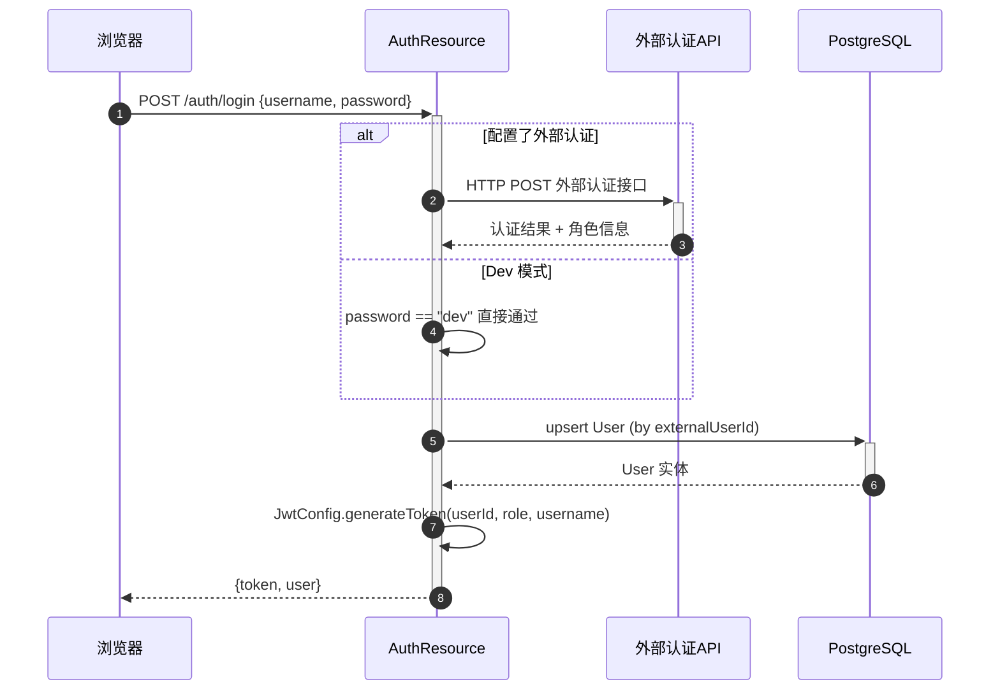
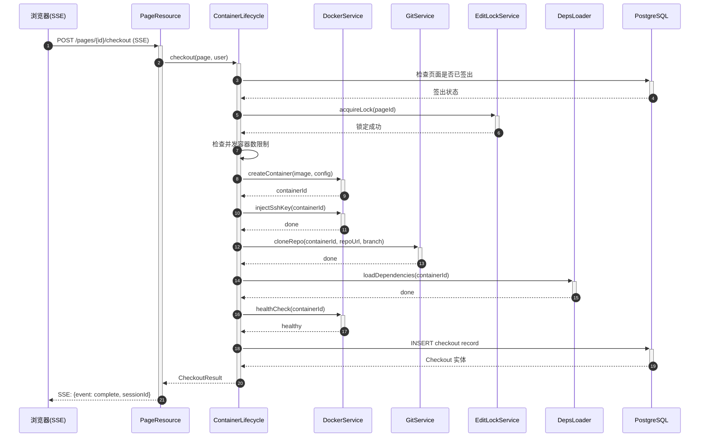
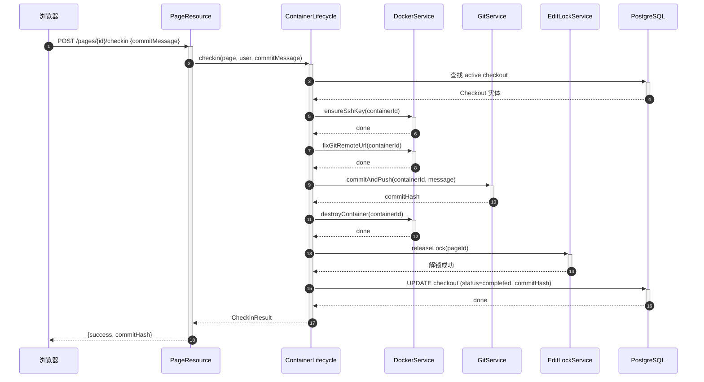
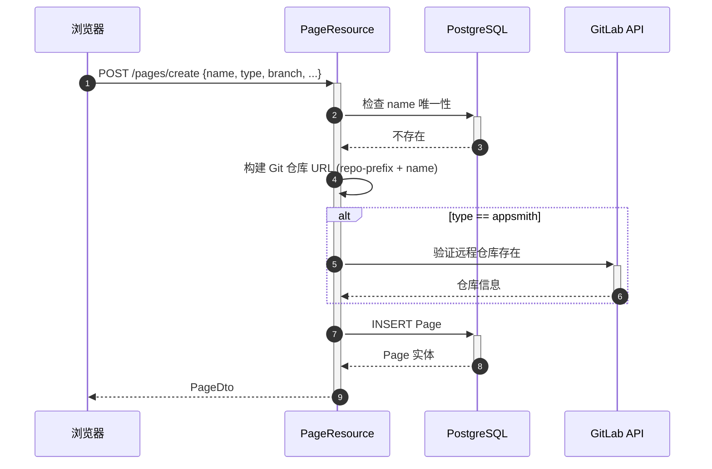
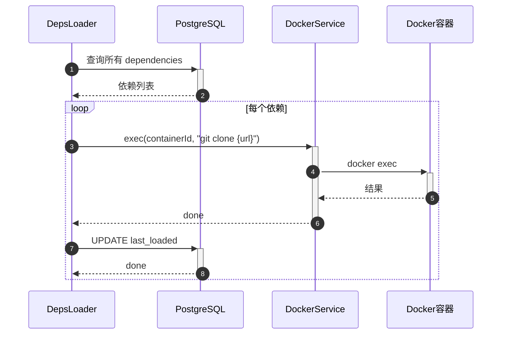
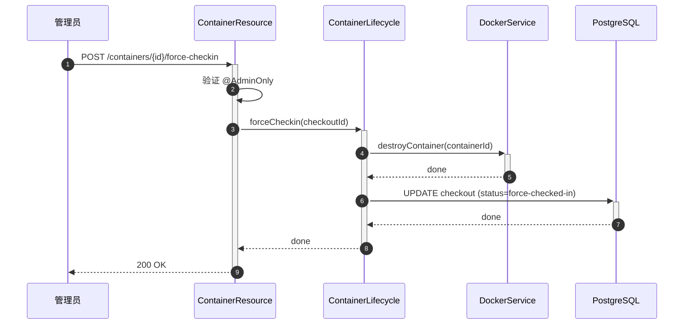

# 核心业务流程

> 分析来源：入口函数、控制器、服务层代码
> 图例：实线 = 同步调用，虚线 = 异步/事件，[DB] = 数据库操作，[EXT] = 外部服务

---

## 1. 用户登录流程
> 触发入口：POST /api/ide/auth/login
> 影响数据：users 表（upsert）
> 副作用：无

**关键节点说明：**
| 步骤 | 函数 | 文件路径 | 备注 |
|------|------|----------|------|
| 1 | login() | resource/AuthResource.java | 入口端点 |
| 2 | HTTP POST | config/AppConfig.java | 外部认证 URL 可配置 |
| 3 | generateToken() | config/JwtConfig.java | HMAC-SHA256, 8小时过期 |

---

## 2. 页面签出流程（核心）
> 触发入口：POST /api/ide/pages/{pageId}/checkout
> 影响数据：checkouts 表（INSERT）
> 副作用：创建 Docker 容器、Git 克隆仓库、注入 SSH 密钥、加载依赖、获取编辑锁

**关键节点说明：**
| 步骤 | 函数 | 文件路径 | 备注 |
|------|------|----------|------|
| 2 | checkout() | service/ContainerLifecycle.java | 编排核心 |
| 5 | acquireLock() | service/EditLockService.java | [EXT] script-engine API |
| 7 | createContainer() | service/DockerService.java | Docker API 调用 |
| 9 | cloneRepo() | service/GitService.java | JGit SSH 克隆 |
| 10 | loadDependencies() | service/DepsLoader.java | 注入所有依赖到容器 |

---

## 3. 页面签入流程
> 触发入口：POST /api/ide/pages/{pageId}/checkin
> 影响数据：checkouts 表（UPDATE status=completed）
> 副作用：Git commit + push、销毁 Docker 容器、释放编辑锁

**关键节点说明：**
| 步骤 | 函数 | 文件路径 | 备注 |
|------|------|----------|------|
| 2 | checkin() | service/ContainerLifecycle.java | 编排核心 |
| 6 | fixGitRemoteUrl() | service/DockerService.java | 处理 token/SSH 认证切换 |
| 7 | commitAndPush() | service/GitService.java | 检测 non-fast-forward 冲突 |
| 8 | destroyContainer() | service/DockerService.java | Docker API 销毁 |

---

## 4. 页面创建流程
> 触发入口：POST /api/ide/pages/create
> 影响数据：pages 表（INSERT）
> 副作用：GitLab API 验证仓库存在性（Appsmith 类型）

---

## 5. 依赖加载流程
> 触发入口：容器签出时自动执行 / POST /api/ide/deps/{id}/refresh
> 影响数据：dependencies 表（UPDATE last_loaded）
> 副作用：向 Docker 容器内克隆/复制依赖

---

## 6. 管理员强制操作流程
> 触发入口：POST /api/ide/containers/{id}/force-checkin 或 force-destroy
> 影响数据：checkouts 表（UPDATE status）
> 副作用：销毁 Docker 容器、释放编辑锁

