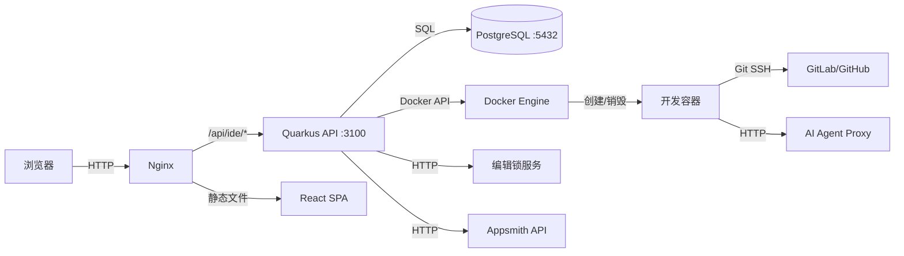
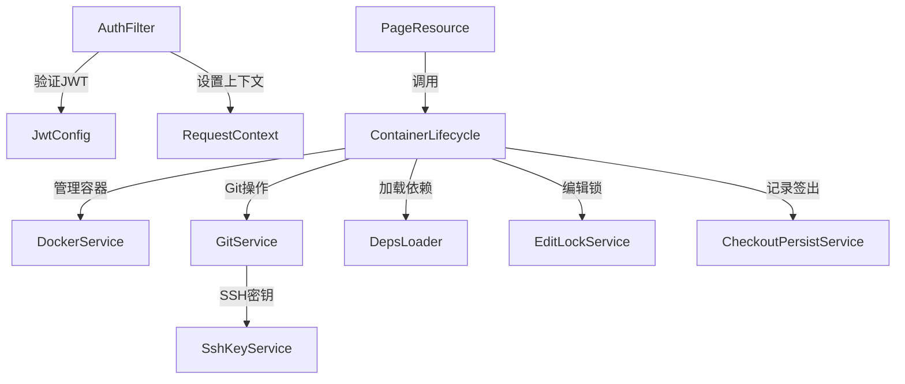

# 系统架构

## 整体架构类型
前后端分离 + 容器化隔离开发环境

系统由以下主要部分组成：
- **Quarkus Java 后端**: 核心 REST API，负责用户认证、页面管理、容器编排
- **React 前端 SPA**: Web IDE 界面，Monaco 编辑器，AI 聊天面板
- **PostgreSQL 数据库**: 持久化所有业务数据
- **Docker 容器**: 每个用户签出页面时动态创建隔离开发容器
- **Nginx 反向代理**: 静态文件服务 + API 代理

## 模块结构
| 模块 | 路径 | 职责 |
|------|------|------|
| backend-java | packages/backend-java | Quarkus REST API，核心业务逻辑，容器编排 |
| frontend | packages/frontend | React SPA，Web IDE 界面，Monaco 编辑器 |
| backend (Node) | packages/backend | Fastify + Prisma，数据库迁移辅助（次要） |
| container-services | packages/container-services | AI 代理 + 文件管理器（容器内服务） |
| redux-node-service | redux-node-service | Appsmith Redux 操作支持 |
| deploy | deploy/ | Docker Compose 生产部署配置 |
| docker | docker/ | 容器镜像构建和开发环境配置 |

## 请求/数据流

## 关键依赖关系

## 外部依赖服务
| 服务 | 用途 | 配置位置 |
|------|------|----------|
| GitLab/GitHub | 代码仓库托管，签入签出时的 clone/push | system_configs 表 (gitlab.api-base-url, git.token) |
| Docker Engine | 容器生命周期管理 | application.properties (aiide.container.*) |
| 编辑锁服务 (script-engine) | Appsmith 页面互斥编辑控制 | application.properties (aiide.edit-lock-api-url) |
| Appsmith API | 页面编辑 URL 构建、JS 对象同步 | application.properties (aiide.appsmith-api-base-url) |
| AI Agent Proxy | AI 代码辅助（Claude API 代理） | application.properties (aiide.ai-agent-url) |
| 外部认证 API | 用户身份验证（可选，有 dev 模式回退） | application.properties (aiide.auth.*) |
