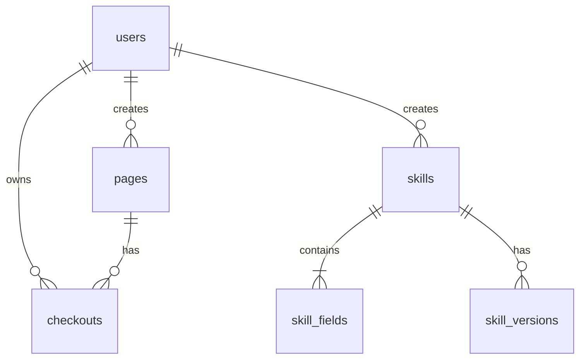

# 数据模型

## 持久化方式
| 数据 | 存储方式 | 文件位置 |
|------|----------|----------|
| 业务数据 | PostgreSQL 16 | Flyway: packages/backend-java/src/main/resources/db/migration/ |
| ORM 映射 | Hibernate Panache | packages/backend-java/src/main/java/com/appsmith/aiide/entity/ |
| Prisma schema (辅助) | Prisma ORM | packages/backend/prisma/schema.prisma |

## 核心数据模型

### users（用户表）
| 列名 | 类型 | 约束 | 说明 |
|------|------|------|------|
| id | UUID | PK | 主键 |
| external_user_id | VARCHAR | UNIQUE | 外部系统用户 ID |
| username | VARCHAR | NOT NULL | 用户名 |
| display_name | VARCHAR | | 显示名称 |
| role | VARCHAR | NOT NULL | 角色: admin / developer |
| active_skills | JSONB | | 用户激活的技能列表 |
| created_at | TIMESTAMPTZ | | 创建时间 |
| updated_at | TIMESTAMPTZ | | 更新时间 |

### pages（页面表）
| 列名 | 类型 | 约束 | 说明 |
|------|------|------|------|
| id | UUID | PK | 主键 |
| name | VARCHAR | UNIQUE, NOT NULL | 页面名称 |
| type | VARCHAR | NOT NULL | 类型: appsmith / normal |
| description | TEXT | | 描述 |
| gitlab_repo_url | TEXT | | Git 仓库 URL |
| git_branch | VARCHAR | DEFAULT 'dev' | Git 分支 |
| appsmith_page_id | TEXT | | Appsmith 页面 ID（可选） |
| created_by | UUID | FK → users | 创建者 |
| created_at | TIMESTAMPTZ | | 创建时间 |
| updated_at | TIMESTAMPTZ | | 更新时间 |

### checkouts（签出记录表）
| 列名 | 类型 | 约束 | 说明 |
|------|------|------|------|
| id | UUID | PK | 主键 |
| page_id | VARCHAR | NOT NULL | 页面 ID |
| page_name | VARCHAR | | 页面名称（冗余） |
| user_id | UUID | FK → users | 签出用户 |
| status | VARCHAR | NOT NULL | 状态: active / completed / force-checked-in / force-destroyed |
| container_id | VARCHAR | | Docker 容器 ID |
| session_id | VARCHAR | | 会话 ID |
| gitlab_repo_url | TEXT | | 仓库 URL |
| git_branch | VARCHAR | | Git 分支 |
| commit_message | VARCHAR | | 签入时的提交信息 |
| commit_hash | VARCHAR | | 签入后的提交哈希 |
| checked_out_at | TIMESTAMPTZ | | 签出时间 |
| checked_in_at | TIMESTAMPTZ | | 签入时间 |
| created_at | TIMESTAMPTZ | | 创建时间 |
| updated_at | TIMESTAMPTZ | | 更新时间 |

### skills（技能表）
| 列名 | 类型 | 约束 | 说明 |
|------|------|------|------|
| id | UUID | PK | 主键 |
| name | VARCHAR | UNIQUE, NOT NULL | 技能名称 |
| description | TEXT | | 描述 |
| icon | VARCHAR | | 图标标识 |
| category | VARCHAR | | 分类 |
| prompt | TEXT | | AI 提示词模板 |
| keywords | JSONB | | 关键词列表 |
| tags | JSONB | | 标签列表 |
| enabled | BOOLEAN | DEFAULT true | 是否启用 |
| version | VARCHAR | DEFAULT 'v1.0' | 当前版本 |
| call_count | INTEGER | DEFAULT 0 | 调用次数统计 |
| created_by | UUID | FK → users | 创建者 |
| created_at | TIMESTAMPTZ | | 创建时间 |
| updated_at | TIMESTAMPTZ | | 更新时间 |

### skill_fields（技能字段表）
| 列名 | 类型 | 约束 | 说明 |
|------|------|------|------|
| id | UUID | PK | 主键 |
| skill_id | UUID | FK → skills | 所属技能 |
| field_id | VARCHAR | | 字段标识 |
| label | VARCHAR | | 字段标签 |
| type | VARCHAR | | 类型: text / select / number 等 |
| required | BOOLEAN | | 是否必填 |
| placeholder | TEXT | | 占位提示文本 |
| options | JSONB | | 选项列表（用于 select 类型） |
| token | VARCHAR | | 模板替换标记 |
| sort_order | INTEGER | | 排序序号 |

### skill_versions（技能版本表）
| 列名 | 类型 | 约束 | 说明 |
|------|------|------|------|
| id | UUID | PK | 主键 |
| skill_id | UUID | FK → skills | 所属技能 |
| version | VARCHAR | | 版本号 |
| changelog | TEXT | | 变更日志 |
| schema_snapshot | JSONB | | 当时的技能 schema 快照 |
| published | BOOLEAN | | 是否已发布 |

### dependencies（依赖表）
| 列名 | 类型 | 约束 | 说明 |
|------|------|------|------|
| id | UUID | PK | 主键 |
| namespace | VARCHAR | UNIQUE | 命名空间标识 |
| url | TEXT | | 依赖来源 URL |
| version | VARCHAR | | 版本号 |
| description | TEXT | | 描述 |
| last_loaded | TIMESTAMPTZ | | 最后加载时间 |
| created_at | TIMESTAMPTZ | | 创建时间 |

### system_configs（系统配置表）
| 列名 | 类型 | 约束 | 说明 |
|------|------|------|------|
| id | UUID | PK | 主键 |
| key | VARCHAR | UNIQUE, NOT NULL | 配置键 |
| value | JSONB | | 配置值 |
| description | TEXT | | 描述 |
| created_at | TIMESTAMPTZ | | 创建时间 |
| updated_at | TIMESTAMPTZ | | 更新时间 |

## 实体关系图

## 关键系统配置项
| key | 用途 | 示例值 |
|-----|------|--------|
| gitlab.api-base-url | GitLab API 基础 URL | https://gitlab.example.com/api/v4 |
| gitlab.repo-prefix | Git 仓库前缀 | git@gitlab.internal:appsmith/ |
| git.token | Git 访问令牌 | ghp_xxxx |
| appsmith.session | Appsmith 会话 cookie | SESSION=xxx |
