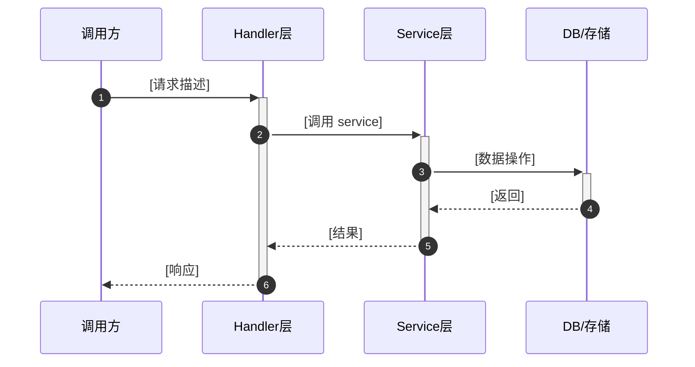

# AI 行为分析扫描规范

> 适用范围：任意技术栈的已有项目
> 使用方式：将本文件内容 + 项目扫描结果一起发给 AI，生成行为层辅助文件
> 前置条件：`docs/generated/struct/` 下的结构文档已生成

---

## 使用步骤

1. 确认 `docs/generated/struct/` 下已有结构分析文档
2. 运行 `bash scripts/scan-project.sh > project_scan.txt`（如已有可跳过）
3. 将扫描结果 + 本提示词正文一起发给 AI
4. AI 将严格按格式输出 3 个行为层文件

---

## 提示词正文（从此处开始复制）

---

你是一名资深软件工程师，擅长代码阅读和逆向分析。
请根据以下项目扫描结果，严格按照指定格式生成行为层辅助文件。

**分析原则：**
- 只描述代码中实际存在的行为，禁止推测或捏造
- 从测试文件提取使用示例（测试是最可信的用法文档）
- 副作用必须明确标注，不确定时标注 `[需人工确认]`
- 危险操作用 `⚠` 标注，不可逆操作用 `🔴` 标注
- 找不到的内容统一填 `[待补充]`，不猜测

---

### 项目扫描结果

```
[粘贴 project_scan.txt 内容]
```

---

### 请按以下格式生成全部 3 个文件

---

#### 文件 1：`docs/generated/behave/FLOWS.md` — 业务流程图

```markdown
---
type: flows
last_updated: [今天日期]
generated_by: claude-code
prompt: docs/prompts/AI_BEHAVIOR_SCAN_PROMPT.md
related: [USAGE.md, CALLGRAPH.md, ../struct/ARCHITECTURE.md]
reviewed_by: pending
ai_instruction: 理解任何功能的实现路径前，先查此文件确认完整链路
---

# 核心业务流程

> 分析来源：入口函数、控制器、服务层代码
> 图例：实线 = 同步调用，虚线 = 异步/事件，[DB] = 数据库操作，[EXT] = 外部服务

## [流程名称]
> 触发入口：[函数名 / HTTP路径 / 事件名]
> 影响数据：[涉及的数据库表或状态]
> 副作用：[发邮件 / 写文件 / 硬件操作 / 无 等]



**关键节点说明：**
| 步骤 | 函数 | 文件路径 | 备注 |
|------|------|----------|------|
| [步骤编号] | [函数名()] | [文件路径] | [注意事项] |
```

**必须生成的流程（如果项目中存在）：**
- 用户认证/登录流程
- 核心业务对象的创建流程
- 涉及外部服务/硬件的流程
- 有异步任务的流程
- 数据删除/状态变更的不可逆流程

---

#### 文件 2：`docs/generated/behave/USAGE.md` — 模块使用说明

```markdown
---
type: usage
last_updated: [今天日期]
generated_by: claude-code
prompt: docs/prompts/AI_BEHAVIOR_SCAN_PROMPT.md
related: [../struct/CONVENTIONS.md, CALLGRAPH.md, ../struct/API.md]
reviewed_by: pending
ai_instruction: 调用任何核心模块或函数前先查此文件
---

# 模块使用说明

> 标注说明：⚠ = 需注意，🔴 = 危险/不可逆，✅ = 推荐写法，❌ = 禁止写法

## [模块名 / 文件路径]

**职责：** [一句话]
**运行环境：** [Node.js / Browser / WPF / 后台线程 等]
**状态：** [无状态 / 有状态]

### `[函数名](参数): 返回类型`

**用途：** [一句话]

**副作用：**
- [ ] 数据库写入
- [ ] 外部 HTTP 请求
- [ ] 文件系统操作
- [ ] 硬件/通信操作
- [x] 无副作用（只读）

**✅ 正确用法：**
```code
[代码示例]
```

**❌ 错误用法（AI 禁止）：**
```code
[反例代码]
```
```

---

#### 文件 3：`docs/generated/behave/CALLGRAPH.md` — 关键调用链

```markdown
---
type: callgraph
last_updated: [今天日期]
generated_by: claude-code
prompt: docs/prompts/AI_BEHAVIOR_SCAN_PROMPT.md
related: [FLOWS.md, USAGE.md, ../struct/ARCHITECTURE.md]
reviewed_by: pending
ai_instruction: 修改任何核心函数前，先查此文件确认影响范围
---

# 关键调用链

> 格式说明：
> `───` 表示同步调用
> `↷` 表示异步调用
> `[DB]` 表示数据库操作
> `[EXT]` 表示外部服务/硬件
> `⚠` 表示副作用节点
> `🔴` 表示高风险节点

## 入口 → 执行链路

### [链路名称]

```text
[触发入口]
  ─── [函数调用]              [文件路径]
       ─── [子调用]           [DB] / [EXT] / 标注
  ─── [返回]
```

**影响范围分析：**
| 修改目标 | 直接影响 | 间接影响 |
|----------|----------|----------|
| [函数名] | [直接影响] | [间接影响] |

## 反向依赖索引

| 函数 | 文件路径 | 被哪些文件调用 | 影响等级 |
|------|----------|---------------|----------|
| [函数名()] | [路径] | [调用方列表] | 高/中/低 |

## 高风险修改区域

| 级别 | 函数/模块 | 原因 | 修改前必须 |
|------|----------|------|-----------|
| 🔴 极高 | [函数名] | [原因] | 人工审查 + 完整测试 |
| ⚠ 高 | [函数名] | [原因] | 确认影响范围 |
```

---

### 输出要求

1. 按顺序输出全部 3 个文件
2. 每个文件之间用 `=== 文件路径 ===` 分隔
3. 找不到的内容填 `[待补充]`，不猜测
4. 每个文件生成完毕后输出：`✓ [文件名] 生成完毕`
